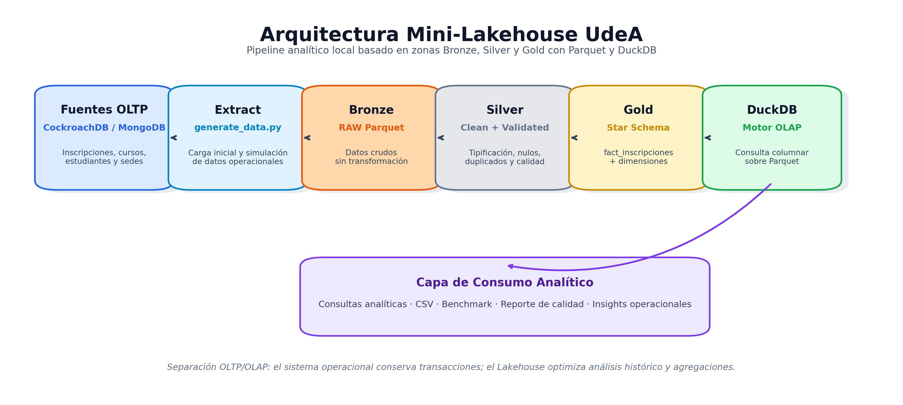
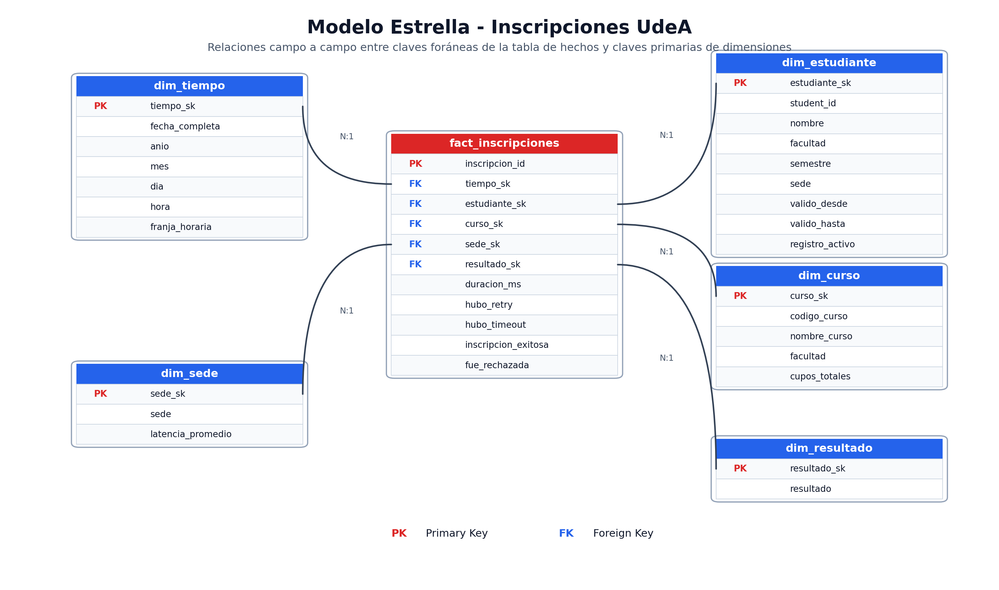

# 🎓 Mini-Lakehouse Distribuido UdeA

## Analítica distribuida de matrículas académicas bajo alta concurrencia

---

# 📌 Descripción

Este proyecto implementa un Mini-Lakehouse académico inspirado en escenarios reales de matrícula de la Universidad de Antioquia (UdeA), donde cientos de miles de estudiantes intentan registrar cursos simultáneamente durante ventanas críticas de inscripción.

La solución modela:

- hotspots sobre cursos de alta demanda;
- retries transaccionales;
- timeouts;
- latencia regional;
- contención concurrente;
- separación OLTP vs OLAP;
- y procesamiento analítico distribuido.

El sistema fue construido usando arquitectura Medallion (Bronze / Silver / Gold) con archivos Parquet y DuckDB como motor analítico local.

---

# 🧠 Problema de negocio

Durante los periodos de matrícula académica:

- miles de estudiantes acceden simultáneamente;
- cursos obligatorios generan alta contención;
- aparecen retries y timeouts;
- las sedes regionales presentan variaciones de latencia;
- y el sistema operacional se degrada bajo carga.

El cuello de botella principal no corresponde al estudiante (`student_id`), sino al curso (`course_id`) durante ventanas temporales específicas.

Ejemplo:

```sql
UPDATE cursos
SET cupos_ocupados = cupos_ocupados + 1
WHERE course_id = 'MATE301'
```

Cuando miles de estudiantes ejecutan esta operación concurrentemente aparecen:
- locks;
- retries;
- thundering herd;
- y degradación operacional.

---

# 🏗️ Arquitectura Lakehouse



---

# ⭐ Modelo Dimensional



---

# 🥉 Bronze Layer

Almacena datos operacionales crudos:

- estudiantes;
- cursos;
- inscripciones;
- retries;
- timeouts;
- métricas de latencia.

Formato utilizado:

```text
Parquet
```

---

# 🥈 Silver Layer

Implementa:

- limpieza;
- tipificación;
- eliminación de duplicados;
- validación;
- control de calidad.

Genera:

```text
reporte_calidad_silver.txt
```

---

# 🥇 Gold Layer

Implementa un modelo estrella analítico compuesto por:

## Tabla de hechos

```text
fact_inscripciones
```

Granularidad:

```text
1 fila = 1 intento de inscripción
```

## Dimensiones

- dim_tiempo
- dim_estudiante
- dim_curso
- dim_sede
- dim_resultado

---

# 🕒 SCD Tipo 2

La dimensión `dim_estudiante` implementa Slowly Changing Dimension Tipo 2 mediante:

- valido_desde
- valido_hasta
- registro_activo

---

# 📊 Dashboard Analítico

El proyecto incluye un dashboard interactivo construido con Streamlit.

Muestra:

- cursos hotspot;
- retries;
- timeouts;
- latencia regional;
- horarios pico;
- comportamiento operacional;
- métricas analíticas.

---

# ⚙️ Tecnologías utilizadas

| Tecnología | Uso |
|---|---|
| Python | Pipeline |
| DuckDB | Motor OLAP |
| Parquet | Almacenamiento columnar |
| Pandas | Transformaciones |
| Streamlit | Dashboard |
| Plotly | Visualización |
| Faker | Datos sintéticos |
| Graphviz / Matplotlib | Diagramas |

---

# 📈 Benchmark

Se comparó:

- Pandas sobre Silver;
- DuckDB sobre Gold.

## Resultados

| Motor | Tiempo |
|---|---|
| Pandas | 120.89 ms |
| DuckDB | 71.65 ms |

### Mejora observada

```text
1.69x más rápido
```

---

# 📦 Volumen simulado

| Entidad | Cantidad |
|---|---|
| Estudiantes | 200.000 |
| Cursos | 500 |
| Intentos de inscripción | 500.000 |

---

# 🚀 Ejecución

## Instalar dependencias

```bash
pip install -r requirements.txt
```

---

## Ejecutar pipeline completo

```bash
python main.py
```

---

## Ejecutar dashboard

```bash
streamlit run dashboard/app.py
```

---

# 📁 Estructura del proyecto

```text
udea-mini-lakehouse/
│
├── dashboard/
├── docs/
├── lakehouse/
│   ├── bronze/
│   ├── silver/
│   └── gold/
├── scripts/
├── README.md
├── requirements.txt
└── main.py
```

---

# 🧩 Consideraciones distribuidas

La solución modela:

- hotspots por curso;
- retries;
- timeouts;
- latencia regional;
- concurrencia masiva;
- separación OLTP / OLAP;
- y cargas analíticas sobre datos históricos.

---

# 🎯 Conclusiones

El proyecto permitió construir un pipeline analítico reproducible orientado a escenarios distribuidos de matrícula académica.

DuckDB demostró ventajas para workloads OLAP sobre archivos Parquet, mientras que el modelo dimensional permitió analizar contención, latencia y comportamiento operacional de forma desacoplada del sistema transaccional.

---

# 👨‍💻 Integrantes

- Nombre 1
- Nombre 2
- Nombre 3